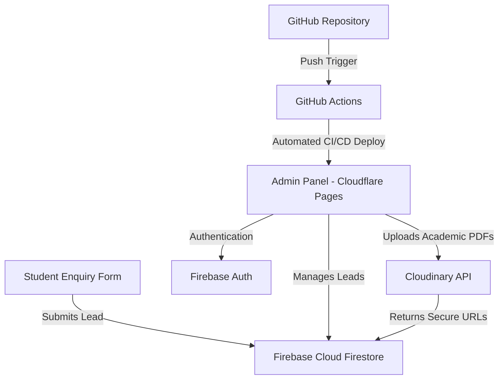

# Pathway Global — Web Platform & Admin Panel Architecture

Pathway Global (formerly known as Pathway Immigration) is a premium, high-converting overseas education, immigration, and language training portal. It is built using responsive layouts, rich glassmorphic aesthetics, and an interactive Three.js 3D WebGL Globe.

---

## 📂 File Guide

* **[index.html](file:///Users/admin/Documents/Flyggo/pathway/index.html)**: Main landing template containing brand hero copy, trust metrics, why students trust us reasons, and the custom **Get FREE Counselling Today!** detailed enquiry form placed at the **3rd section** (immediately below the Brand card) for high-converting UX.
* **[about.html](file:///Users/admin/Documents/Flyggo/pathway/about.html)**: Corporate profile presenting Pathway's history, trust numbers, core strategic pillars, and regional walk-in center hubs (Chennai, Bangalore, Kerala).
* **[services.html](file:///Users/admin/Documents/Flyggo/pathway/services.html)**: Program categories divided into three brand divisions: *Study Abroad* (MBBS, Nursing, Bachelors, Masters, Diplomas), *Immigration* (Student, Work, PR, Visitor Visas), and *Language Training* (IELTS, OET, German).
* **[destinations.html](file:///Users/admin/Documents/Flyggo/pathway/destinations.html)**: Placements mapping featuring the **Interactive Three.js 3D Globe** with glowing destination nodes, bezier flight paths (Chennai ✈ London, Kochi ✈ Tbilisi, Bangalore ✈ Berlin), and custom drag/touch-rotate controls.
* **[challenges.html](file:///Users/admin/Documents/Flyggo/pathway/challenges.html)**: Interactive grid identifying common student problems (OSCE hurdles, visa slot delays, template SOP rejections) and how Pathway's boutique advisory resolves them.
* **[process.html](file:///Users/admin/Documents/Flyggo/pathway/process.html)**: Direct 7-step roadmap timeline (*Counselling ➔ University Selection ➔ Application ➔ Admission Letter ➔ Visa Processing ➔ Travel ➔ Settlement*).
* **[faq.html](file:///Users/admin/Documents/Flyggo/pathway/faq.html)**: Frequently Asked Questions mapping visa processing timelines, financial blocks, post-landing bank/SIM setups, and scholarships.
* **[comparison.html](file:///Users/admin/Documents/Flyggo/pathway/comparison.html)**: Direct transparency calculator. Students enter target country and study levels to get tailored comparative feedback against larger chains (IDP, Edwise, SIEC).
* **[assets/css/main.css](file:///Users/admin/Documents/Flyggo/pathway/assets/css/main.css)**: Core custom styling variables, glassmorphic cards, pulsing badges, ticket cutouts, custom marquee animations, and dark nav styles.
* **[assets/js/main.js](file:///Users/admin/Documents/Flyggo/pathway/assets/js/main.js)**: Mobile nav drawer controls, budget sliders, live admissions feed tickers, and comparison calculation logic.

---

## 💻 Local Development Setup

To run the site locally without external dependencies:

### Option A: VS Code Live Server
1. Open the project folder in VS Code.
2. Click the **Go Live** button in the bottom status bar.
3. The site will launch on `http://127.0.0.1:5500/index.html`.

### Option B: Python Simple Server
Open your terminal in the project root directory and run:
```bash
python3 -m http.server 8000
```
Then navigate to `http://localhost:8000`.

### Option C: Node.js http-server
Install and spin up the server:
```bash
npx http-server -p 8000
```
Navigate to `http://localhost:8000`.

---

## 🛠 Admin Panel Architecture Plan
To handle student enquiry leads, verify uploaded documents, and track admission/visa statuses, we propose a serverless admin stack integrating **Cloudflare**, **Firebase**, **Cloudinary**, and **GitHub**.

### Stack Components



1. **Hosting & CI/CD**: 
   - **GitHub**: Holds the codebase.
   - **Cloudflare Pages**: Hosts the Admin Panel frontend (built with React/Next.js and Tailwind CSS). GitHub Actions trigger builds automatically on push to the `main` branch.
2. **Database & Lead Management**: 
   - **Cloud Firestore (Firebase)**: Stores student profile entries submitted via the enquiry form in real-time. Enquiries track status transitions:
     - `Pending Evaluation` ➔ `Shortlist Shared` ➔ `Admitted (Offer Letter)` ➔ `Visa Slot Booked` ➔ `Visa Approved / Settled`.
3. **Authentication**: 
   - **Firebase Authentication**: Secures the Admin Portal with Role-Based Access Control (RBAC) supporting:
     - *Admins* (full system oversight).
     - *Counselors* (read/edit assigned student leads).
4. **Document Storage**: 
   - **Cloudinary**: Stores student transcripts, passport copies, Statement of Purpose (SOP) drafts, and NHS/Visa stamps. Files upload directly from the admin panel to Cloudinary, and secure HTTPS URLs are saved in Firestore lead objects.

---

## 🤖 AI Prompt to Build the Admin Panel
Copy and paste this system prompt to an AI coding assistant to generate the Admin Panel codebase in React/Next.js:

```text
Act as an expert Senior Full-Stack Developer. I want you to build a secure Admin Panel for "Pathway Global" study abroad consultancy.

Technical Stack requirements:
1. Frontend: React.js or Next.js (App Router), styled with Tailwind CSS, using lucide-react icons.
2. Backend/Database: Cloud Firebase SDK (Firestore for data, Firebase Auth for security).
3. Asset Uploads: Cloudinary API (secure unsigned image/document uploads for academic PDFs and passports).

Key Features & UI Layout:
- Login Screen: Firebase Auth email/password login restricted to "@pathwayglobal.in" domain emails.
- Leads Dashboard:
  * A structured datatable listing student enquiries with columns: Student Name, Mobile, Destination, Study Level, Assigned Counselor, Status, and Date.
  * Status Filter tabs: All, Pending, Shortlisted, Admitted, Visa Processing, Settled.
  * Quick Status update dropdowns directly inside the row.
- Student Details View:
  * Left Column: Detailed profile information (academic history, funding methods, nearest walk-in hub coordinates).
  * Center Column: SOP Draft editor and counselor remarks history.
  * Right Column: Document Checklist (10th mark sheet, 12th mark sheet, Passport copy, SOP, Visa Stamp). Files upload directly to Cloudinary and display as clickable secure links with green checkmarks.
- Integration coordinates:
  * Provide empty configuration files for firebaseConfig.js and cloudinaryConfig.js where I can paste my credentials.
  * Ensure all layouts are responsive and use Tailwind's slate-900 / emerald-600 color scheme.
```
